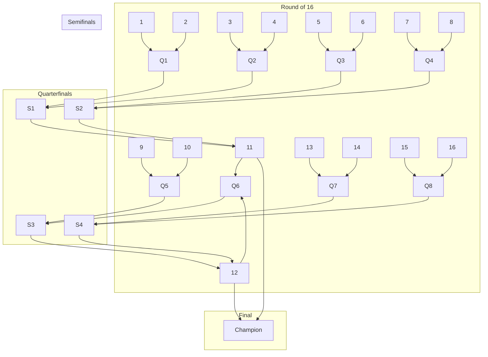

# Structuring Latte Art and Espresso Throwdown Competitions

## Executive summary

Latte art and espresso throwdowns sit on a spectrum that runs from **formal, heavily documented championships** to **fast, crowd-friendly head‑to‑head “point-and-advance” battles**. If you want your event to be fair, watchable, and repeatable, you need to decide (1) which end of that spectrum you’re on, and then (2) align **format, scoring, staffing, and logistics** to that choice.

Three proven “reference architectures” emerge from primary and official rule sources:

- **Championship model (deeply structured, multi‑judge, slower throughput)**: the entity["sports_event","World Barista Championship","sca wcc espresso-based comp"] and entity["sports_event","World Latte Art Championship","sca wcc latte art comp"] emphasize calibrated judging, formal score sheets, and defined time blocks with formal protest/appeal processes. citeturn21view0turn9view1turn9view5  
- **Festival throwdown model (fast bracket, simple scoring, high throughput)**: entity["sports_event","Latte Art World Championship Open","coffee fest latte art event"] uses sudden‑death brackets, short time windows, and a small set of visual categories scored head‑to‑head. citeturn38view0turn38view1turn35search0  
- **Regional/local “house rules” model (lightweight governance, maximum fun)**: examples include local org rules that explicitly address **tie-breakers, conflicts of interest, and timeboxing**, without the administrative weight of a championship. citeturn33search16turn33search2

A rigorous event design uses the official sources as *constraints* (timekeeping, judging separation, disqualification triggers, appeal mechanics), then selects a **format + scoring rubric** that matches your goals (community building, skill testing, sponsor activation, or qualifying pipeline). citeturn21view0turn24view2turn38view1

## Official rule frameworks you can borrow from

### The SCA/WCC baseline for espresso performance and judging

The entity["organization","World Coffee Championships","sca championships program"] rules ecosystem (operated under the entity["organization","Specialty Coffee Association","global coffee trade org"] umbrella) is the most formal reference point for espresso-based competition and is designed for **repeatability and governance** (standardized timing, defined judge roles, and formal scoring documentation). citeturn0search4turn21view0

Key structural elements you can directly reuse for an espresso-focused competition block:

- **Round structure**: WBC is run in **three rounds** (Preliminary, Semi-Final, Final). citeturn21view0turn4view0  
- **Time blocks are explicit**: WBC defines a station “slot” with **table set time (7 min), preparation time (15 min), performance (15 min), and clean-up (7 min)**—44 minutes total per competitor station cycle. citeturn21view0turn4view0  
- **Judging panel is role-separated**: WBC explicitly uses **technical judges** and **sensory judges** plus a head judge. citeturn21view0turn15view0turn15view1  
- **Scoresheets are standardized**: the WBC technical and sensory score sheets operationalize what “good” means and make tie resolution and auditability possible. citeturn15view0turn15view1turn15view2turn18view0  
- **Beverage definitions matter** (even if you’re “just doing espresso”): WBC defines beverage service components (espresso and milk beverage details, etc.), which is one reason WBC outcomes are defensible. citeturn7view2  

**What this means for an “espresso throwdown”:** if you want espresso judging to be more than “vibes,” you need (a) defined service parameters (dose/yield target or at least a bounded range), (b) a sensory rubric that separates “accuracy of descriptors” vs “taste experience,” and (c) technical controls that reduce random variance (machine warm‑up, grinder stability, water, time). WBC’s structure is the most mature template for that. citeturn15view1turn21view0turn35search0

### The SCA/WCC baseline for latte art: WLAC stage + art bar

The entity["sports_event","World Latte Art Championship","sca wcc latte art comp"] is the most formal latte-art-specific rulebook and is built around (1) staged performance with defined beverages and (2) an optional Art Bar component. citeturn9view1turn23view0turn23view1

Structural mechanics worth copying into any serious latte art competition:

- **Rounds scale by competitor count**: WLAC notes that the number of rounds can change depending on the number of competitors (e.g., 3 rounds up to a threshold; adjustments beyond that). citeturn22view0turn23view0  
- **Head‑to‑head, simultaneous pouring is core**: WLAC stage performances are built around **two competitors at a time**, which is the same fundamental “throwdown” idea—but with formal evaluation mechanics. citeturn9view1turn9view0  
- **Time limits are explicit and penalized**: WLAC applies **overtime point deductions per second** and disqualification beyond a maximum overage; Art Bar has a hard disqualification for missing the submission window. citeturn24view2turn9view5turn23view1  
- **Art Bar is explicitly separated**: WLAC’s Art Bar is framed as part of preliminaries, with its own timing and possible separate award—and the rulebook states Art Bar scores don’t count toward the WLAC stage title. citeturn23view1  
- **Evaluation scales are defined** (0–6 for quality-type scales; 0–3 for impression/accuracy-type scales), which supports judge calibration. citeturn9view4turn12view2turn15view1  
- **Disqualification triggers can be surprisingly specific** (example: forbidden floor furniture/obstructions and storage constraints), which is exactly the kind of language that prevents arguments on event day. citeturn24view2turn9view5  

### A high-throughput “official throwdown” reference: Coffee Fest LAWCO

entity["sports_event","Coffee Fest","us coffee trade show"]’s entity["sports_event","Latte Art World Championship Open","coffee fest latte art event"] is an unusually complete “festival throwdown” rule set: it has a bracket model, explicit station setup, a short timed window, simplified scoring, and strong behavior/disqualification language. citeturn38view0turn38view1turn38view2turn35search0

Key mechanics commonly reused by event producers:

- **Bracket-style sudden death**: head-to-head “matches” with immediate elimination. citeturn38view0  
- **Ultra-short pour window**: both competitors have **2.5 minutes** to pour and submit a drink meeting the submission condition (touching the judging plate under the camera). citeturn38view1  
- **Simple scoring (7 categories, 1 point each)**: speed, balance/symmetry, color distribution, line clarity, creativity/difficulty, “call your pour,” presentation; winners typically advance by 3–0 or 2–1 across judges. citeturn38view1  
- **Built-in governance for no-shows and misconduct** (including a stated suspension period for no-shows). citeturn38view1turn38view2  
- **Equipment and calibration profile is stated** (machines/grinders and a pre-calibrated espresso “profile”), which is rare in informal throwdowns and extremely valuable for fairness. citeturn35search0  
- **Public-facing equal opportunity language** in the rules page, which is good practice if you want to scale and attract sponsors. citeturn38view2  

### Espresso throwdowns: what “official” looks like when it exists

“Espresso throwdown” is not a single standardized format globally. The closest widely documented, throwdown-adjacent espresso competition model (as a public event) is Coffee Fest’s historic **America’s Best Espresso** competition, described across multiple credible industry sources as:

- Early head‑to‑head rounds with short brew windows, and later rounds with longer time to prepare multiple espressos for a judge panel. citeturn34search8turn34search19  
- Judging categories focused on espresso sensory attributes (e.g., flavor complexity, mouthfeel/appeal, aftertaste). citeturn34search8turn35search5  

This is important because it highlights a real constraint: **espresso is harder than latte art to adjudicate quickly** without drifting into randomness, because extraction variance is high and sensory evaluation takes time. If you insist on “fast espresso battles,” you must compensate with stronger controls (calibration, target extraction ranges, and a defined tasting workflow) or accept that it’s entertainment first and measurement second. citeturn21view0turn35search0turn34search8

## Formats and round structures that actually work

### Format selection: pick your “throughput vs rigor” point

Below is a comparative table of common, documented formats—ranging from championship structures to throwdowns—so you can select deliberately rather than by tradition.

| Format archetype | Best for | Typical structure | Time per matchup / competitor | Eliminations | Source anchors |
|---|---|---|---|---|---|
| Championship espresso service | Highest rigor, sponsor visibility, formal titles | Multi‑round (prelims → semis → finals), multiple judge roles, full score sheets | ~44 min per competitor station cycle (set/prep/performance/clean) | Cut to top scorers each round | WBC rules timing blocks citeturn21view0turn4view0 |
| Championship latte art | Formal latte art title + staged performance | Head-to-head stage rounds + Art Bar component; defined drinks and timekeeping | Minutes-scale stage windows; separate Art Bar prep+comp window | Cut to finalists | WLAC stage + Art Bar structure citeturn23view0turn23view1turn24view2 |
| Festival latte art “LAWCO style” | High throughput, audience engagement | Single-elimination bracket, 3 judges, short pour window | 2.5 min pour window; movement/cleanup rules | Immediate elimination | Coffee Fest LAWCO rules citeturn38view0turn38view1turn35search0 |
| Regional timed latte art qualifier | Medium throughput, simple rules | Single elimination; 2 at a time; one attempt; limited time | ≤5 minutes per competitor (commonly) | Immediate elimination | Austin Coffee Festival rules citeturn33search18 |
| Classic community throwdown | Low overhead, community building | Head-to-head pairs; judges point; tie-break judge | Often 3–5 minutes per battle | Immediate elimination | NZSCA throwdown rules (3 judges + tie-break) citeturn33search16 |
| Programmed “pattern call” throwdown | Skill testing + consistency | Patterns announced per round (“call your pour”); judges point | ~3 minutes per battle | Immediate elimination | Coffeeast event format (3 min; patterns announced day-of) citeturn33search11 |
| Multi-discipline “battle” | Festival spectacle + broad skills | Several disciplines (service order, latte art, cupping, signature drink) | Per discipline; explicit scoring by placement/time | Points leaderboard | Ljubljana Coffee Festival “Barista Battle” rules citeturn37view0 |

### Recommended bracket structures (with tradeoffs)

If you don’t specify constraints, the most useful way to present options is by bracket type:

- **Single-elimination**: fastest, clearest for audiences; punishes one mistake; best for 8/16/32/64 entrants. citeturn38view0turn33search11turn33search18  
- **Double-elimination**: fairer (one loss doesn’t kill you), but harder to schedule and explain live (especially for non-power-of-two fields).  
- **Swiss (fixed rounds, points standings)**: good when you want everyone to play multiple rounds; harder for casual audiences; better for espresso sensory events where sample size matters. (In practice, coffee festivals more commonly use bracket or placement points. citeturn37view0turn38view0)

#### Mermaid: single-elimination bracket (16 competitors)



This bracket style maps directly onto many public throwdown descriptions (head‑to‑head, win-and-advance). citeturn38view0turn33search11turn33search18

image_group{"layout":"carousel","aspect_ratio":"16:9","query":["latte art throwdown head to head competition","Coffee Fest Latte Art World Championship Open competition","World Latte Art Championship stage competition","World Barista Championship stage espresso competition"],"num_per_query":1}

### Heat sizing and station math

- **One espresso station**: you can only run one battle at a time; your throughput is constrained by pour window + reset/cleanup + judge decision time. Coffee Fest LAWCO explicitly couples pouring to strict rules about post-time equipment use (only for clean up), which is a good control to reduce chaos. citeturn38view1  
- **Two stations**: you can alternate “battle” and “reset,” or run parallel battles (but then you need duplicate judge coverage or a stronger runner/judge logistics plan). Coffee Fest LAWCO describes “facing machines” and a two-station setup. citeturn35search0turn38view0  
- **WLAC-style stage**: two competitors at a time with an explicit performance window and defined judge panel; this is slower but far more defensible than “speed only.” citeturn9view1turn23view0  

## Scoring rubrics and judging panels

### Comparative scoring systems

| Competition type | Scoring style | Categories / scales | Tie resolution | Source anchors |
|---|---|---|---|---|
| WBC espresso-based service | Additive points from technical + sensory; structured weighting | Uses 0–6 quality scales; 0–3 accuracy scales; multiple sections (espresso, milk beverage, signature beverage, barista evaluation) | Formal head judge role; governance via rules + documentation | WBC score sheets and rules citeturn15view0turn15view1turn21view0 |
| WLAC stage visual evaluation | Additive visual + performance scoring with defined numeric scales; overtime penalties | Visual scoring sheets (prelim vs semis/finals) and head judge sheets; evaluation scales documented | Head judge governance + formal protest/appeals; overtime penalties can change outcomes | WLAC rules + score sheets citeturn12view0turn14view0turn9view4turn9view5turn24view2 |
| Coffee Fest LAWCO | Head-to-head comparative points (not absolute scoring) | 7 categories; each judge awards 1 point per category to the better pour | Winner per judge = 3–0 or 2–1; categories create partial tie resistance | Coffee Fest LAWCO judging criteria citeturn38view1turn38view0 |
| “Point and advance” local throwdown | Binary decision | Often no formal categories; judges point | Tie-break judge, no discussion | NZSCA rules citeturn33search16 |
| Espresso roast/brew battle | Panel evaluates espresso sensory categories | Reported categories: flavor complexity, mouthfeel/appeal, aftertaste; timed prep for multiple shots | Typically panel decision; may be bracket/seeded tournament | America’s Best Espresso descriptions citeturn34search8turn35search5turn34search19 |

### Judging panels: recommended compositions and why

**Latte art throwdown (fast bracket, LAWCO-style):**
- 3 judges is a proven minimum for legitimacy and tie resistance. citeturn38view0turn38view1turn33search18  
- If you simplify to “judges point,” add an explicit tie-break mechanism (either 3rd judge or a head judge) and address conflicts of interest. citeturn33search16turn33search8  

**Latte art championship-style (WLAC-inspired):**
- Treat the head judge as the procedural authority (time, station rules, appeals) and keep visual scoring consistent via calibration and written criteria. citeturn9view1turn9view5turn12view0  

**Espresso throwdown:**
- If you want espresso outcomes to be credible, you need at least:
  - a defined tasting window and workflow (because espresso changes fast), and  
  - either a structured sensory sheet (WBC-inspired) or a clear category rubric (America’s Best Espresso-type).
  
WBC is the strongest reference for separating sensory vs technical sources of variance. citeturn15view0turn15view1turn21view0  

### Tie-breakers that don’t create chaos

Use one of these, and document it in your rulebook:

- **Head judge decides** after reviewing category-by-category outcomes (works well in LAWCO-style systems where judges already score categories). citeturn38view1turn9view5  
- **Tie-break category** (pre-declared): e.g., “line clarity” supersedes “speed,” etc. (avoids re-pours).  
- **Sudden-death re-pour** with a new pattern call and a shorter time window (best only if you have schedule slack).  
- **Tie-break judge** with no discussion, count-of-three point (documented in NZSCA-style rules). citeturn33search16  

### Sample score sheets you can deploy

These are intentionally “clean room” templates (not copies of official forms), but they align with the real category logic used in official and widely published rules.

#### Sample latte art battle score sheet (LAWCO-like)

**Use-case:** fast bracket, two competitors, 3 judges, binary category wins. citeturn38view1turn38view0

| Match | Competitor A | Competitor B |
|---|---|---|
| Judge name |  |  |
| Category | A wins (1) / B wins (1) |
| Speed |  |
| Balance / Symmetry |  |
| Color distribution |  |
| Line clarity |  |
| Creativity / difficulty |  |
| “Call your pour” (matches declared pattern) |  |
| Presentation (clean cup, fullness, staging) |  |
| **Judge result** | Total A: ___ / Total B: ___ |

**Match result:** A advances / B advances (needs 2 of 3 judge results). citeturn38view1

#### Sample latte art absolute visual rubric (WLAC-inspired)

**Use-case:** non-head-to-head timed round, or when you want an absolute score for seeding. citeturn12view0turn14view1turn9view4  

Use a 0–6 scale (“unacceptable” → “extraordinary”) and keep one 0–3 impression scale if you want to preserve “overall” judgment. citeturn15view1turn9view4

| Category | Scale | Notes |
|---|---:|---|
| Contrast | 0–6 | Visual separation of crema/milk layers |
| Symmetry / balance | 0–6 | Centering and proportionality |
| Line definition | 0–6 | Crisp edges vs muddiness |
| Difficulty | 0–6 | Complexity achieved cleanly |
| Overall visual impact | 0–3 or 0–6 | Keep this small to avoid overriding objective categories |

#### Sample espresso sensory score sheet (WBC + “best espresso” hybrid)

**Use-case:** espresso-only throwdown where technical judging is minimal but sensory credibility matters. citeturn15view1turn34search8turn35search5  

| Category | Scale | Description |
|---|---:|---|
| Flavor clarity / complexity | 0–6 | Depth + distinct notes citeturn34search8turn35search5 |
| Balance (sweet/acid/bitter) | 0–6 | Harmony, no dominant defect citeturn15view1 |
| Body / tactile quality | 0–6 | Texture and structure citeturn35search5turn15view1 |
| Aftertaste / finish | 0–6 | Pleasant persistence citeturn34search8turn35search5 |
| Overall impression | 0–6 | Holistic score (keep last) citeturn15view1 |
| **Time compliance penalty** | -1/sec (optional) | If you adopt WLAC’s “per second” logic; document clearly citeturn24view2 |

### Judge training and calibration: what “good” looks like

If you want a defensible event, don’t skip calibration. The WCC ecosystem explicitly formalizes judge skill development through:

- entity["organization","World Coffee Championships Judge Skills Program","wcc judge training"]: local-level workshops to teach judging/scoring systems and align with SCA research and “Coffee Value Assessment” logic. citeturn26view0  
- entity["organization","WCC Judge Certification","wcc judge credential"]: a two-day test (written + practical) with certification validity rules (e.g., 3-year validity, renewal constraints, and separation between technical vs sensory certification attempts). citeturn25view0  

For multilingual events, adopt the WCC “interpreter best practices” approach: direct translation only (no elaboration), known positioning/mic handling, and head judge authority to warn/disregard translated content if it departs from direct translation. citeturn29view0  

## Logistical needs and staffing blueprint

### Core equipment: latte art throwdown (from “festival throwdown” constraints)

A credible latte art throwdown needs, at minimum, a controlled espresso + steaming environment. Coffee Fest LAWCO publishes a concrete “setup” list you can treat as a reference checklist: espresso machine, espresso grinder, tampers, knock box, milk pitchers, milk, bar towels, and cups—with explicit reminders about what can/can’t be changed. citeturn35search0turn38view1  

**Recommended minimum (single battle station):**
- Espresso machine + grinder (stable, repeatable; ideally pre-calibrated profile). citeturn35search0turn21view0  
- 2–4 steam pitchers per station (plus backups); competitors may be allowed to bring their own pitcher (common in regional rules). citeturn33search18turn34search17turn35search0  
- Cups standardized by size/shape (consistency matters for judging). citeturn35search0turn33search2  
- Scales/timers (if you care about extraction repeatability and schedule integrity—especially for espresso events). citeturn21view0turn35search0  
- Clear station boundaries and a judges table layout with controlled presentation zones (WLAC’s prohibition on certain obstructions/furniture is a clue: define your stage footprint and keep it consistent). citeturn24view2turn38view1  

**Consumables:**
- Milk (whole, plus any alt-milk sponsor product if allowed—Coffee Fest LAWCO has a milk sponsor in its sponsor listing). citeturn38view0  
- Coffee (same coffee for all battles, or defined bracket “coffee of the round” rules). citeturn35search0turn38view0  
- Cleaning supplies: sanitizer solution, towels, steam wand wipes; plus waste bins and a wet/dry cleanup plan. citeturn21view0turn38view1  

### Espresso throwdown-specific logistics

Espresso competitions described by Coffee Fest’s “America’s Best Espresso” sources use a **multiple-shot submission model** (e.g., three espressos delivered to a judge table within a time window). That implies you need:

- a defined **submission protocol** (when/how the shots are delivered, and whether they’re served sequentially to judges), and  
- enough cups/warmers/rinsing capacity to keep judges moving. citeturn34search8turn34search19turn35search5  

If you want to borrow WBC-grade rigor, also plan for:
- separate technical observation (even if only a “light technical” checklist), and  
- sensory calibration. citeturn15view0turn15view1turn21view0turn26view0  

### Staffing roles and recommended counts

For reliable execution, don’t staff by optimism; staff by roles.

**Lean throwdown (single station, ≤16 competitors):**
- Event lead (1)
- MC (1)
- Head judge (1)
- Judges (2–3) (3 is the proven, documented norm for throwdowns) citeturn33search16turn38view0turn33search18  
- Timekeeper (1) (explicitly used in multiple rule sets) citeturn33search18turn23view1  
- Runner (1) for moving drinks/clearing presentation (Coffee Fest explicitly uses a runner for trays/photos). citeturn38view1  
- Bar support / dish / cleanup (1–2)

**Scaled bracket (32–64 competitors, public festival):**
- Add: stage manager (1), dedicated barbacks (2–4), equipment tech (1 on call), registration/check-in staff (2), scorekeeper (1), photographer/media (1–2).  
WBC-style events also explicitly assume structured stage roles and transitions (table set / prep / performance / cleanup) that require dedicated labor. citeturn21view0turn38view1  

### Judge onboarding checklist (practical)

Minimum viable judge prep should include:
- A 20–30 minute calibration using reference pours/shots and the chosen rubric (WCC’s training programs exist because consistency matters). citeturn26view0turn15view1  
- Conflict-of-interest disclosures and recusal rules (explicitly mentioned as a concern in NZSCA-style throwdown rules). citeturn33search16  
- A written decision protocol: whether judges may discuss; when they must decide; and whether point-awards must be simultaneous (again: NZSCA and similar rules show “no discussion” models). citeturn33search16turn33search8  

## Schedule templates with minute-by-minute timelines

### Single-day template: 16-person latte art throwdown (fast bracket)

Assumptions:
- Single-elimination bracket (Round of 16 → Quarters → Semis → Final = 15 total matches). citeturn33search11turn38view0  
- 2.5–5 minute pour windows are common depending on the rule set; Coffee Fest uses 2.5 minutes for two competitors; many regional events use ~5 minutes. citeturn38view1turn33search18turn33search2  

**Operational target:** ~8 minutes per match cycle (pour + presentation + judging + reset). That yields ~2 hours for 15 matches plus breaks.

**Minute-by-minute run sheet (example 3-hour block):**
- 00:00–00:15 — Competitor check-in + bracket confirmation + station orientation (no-shows policy reminder if you adopt one). citeturn38view1  
- 00:15–00:30 — Judges calibration + rules briefing (categories, time windows, submission rules). citeturn38view1turn26view0  
- 00:30–00:35 — Opening remarks (MC) + explain scoring to audience.  
- 00:35–01:35 — Round of 16 (8 matches × ~7.5 min each = ~60 min)  
- 01:35–01:45 — Break / machine purge / milk restock / bracket update  
- 01:45–02:15 — Quarterfinals (4 matches × ~7.5 min = ~30 min)  
- 02:15–02:25 — Break / reset  
- 02:25–02:40 — Semifinals (2 matches × ~7.5 min = ~15 min)  
- 02:40–02:50 — Break / reset / finalist intro  
- 02:50–03:00 — Final (1 match) + rapid tabulation + award announcement  

#### Mermaid: event flow for a single-day throwdown


### Multi-day template: espresso + latte art weekend (more rigorous)

This structure mirrors how multi-round systems separate “qualifying” from “finals” and is compatible with the idea that espresso judging needs more time than latte art. citeturn21view0turn34search8turn23view0  

**Day one (qualifiers):**
- Morning: espresso qualifier blocks  
  - If you adopt a WBC-like station cycle, schedule in 44‑minute station slots per competitor (expensive, but defensible). citeturn21view0turn4view0  
  - If you adopt an America’s Best Espresso style model, schedule a fixed prep window and defined shot submissions. citeturn34search8turn34search19  
- Afternoon: latte art bracket qualifiers (fast)

**Day two (finals + showcase):**
- Championship latte art finals (pattern calls, higher difficulty) (common in programmed throwdowns). citeturn33search11turn38view1  
- Espresso finals (more time, more judges, stronger calibration)

Pragmatically: day one is “throughput”; day two is “production value.”

## Participant rules, governance, prizes, and budgeting

### Participant rules: what belongs in every rule set

Even informal throwdowns benefit from a minimal “governance spine.” Use these categories:

- **Eligibility**: define who can join (industry vs community split is used by some events). citeturn33search11  
- **Equipment rules**: what is provided vs what can be brought (pitchers often allowed; grinders/machines often not). citeturn33search18turn35search0  
- **Run order**: random draw is common; staged roll-call and “on deck” timing rules reduce no-show chaos. citeturn33search11turn35search0  
- **Timekeeping**: define when time starts/stops and what warnings exist. citeturn23view1turn33search18turn24view2  
- **Penalties**:
  - WLAC uses per-second overtime penalties and disqualification beyond a maximum. citeturn24view2turn9view5  
  - Coffee Fest LAWCO uses strong no-show consequences (including an explicit suspension period). citeturn38view1  
- **Appeals / protests**: if you permit appeals, define the window, the authority (head judge), and the documentation standard. WLAC and WBC both treat governance seriously enough to document these processes. citeturn9view5turn21view4  
- **Conduct and integrity**:
  - Coffee Fest explicitly prohibits harassment, sabotage, entering competitor space, and misusing equipment outside competition + cleanup. citeturn38view2turn38view1  
  - The WCC competitor code of conduct sets expectations for law compliance, professionalism, and social media conduct during active appeals. citeturn32view0  

### Prize structures: proven patterns

Common prize types:
- Cash + trophy (high stakes; draws talent) (Coffee Fest LAWCO publishes cash prizes). citeturn38view1  
- Travel + waived fees for future qualifiers (turns your event into a pipeline). citeturn38view1  
- Sponsor product prizes (machines, grinders, gear) (common in regional throwdowns). citeturn33search11  
- “Bragging rights” / community awards (best newcomer, best pattern, crowd favorite) (commonly used in local rulesets). citeturn33search2turn23view1  

### Sample budgets and sponsor roles

These budgets are **illustrative planning models** in USD (not promises of market pricing). The point is to show the **cost structure** you need to account for; adjust by venue and local rates.

#### Budget comparison table

| Line item | Small café throwdown (16 entrants, 1 station) | Mid-size festival bracket (32–64 entrants) | Multi-day espresso + latte weekend |
|---|---:|---:|---:|
| Cash prizes | $200–$800 | $1,500–$10,000+ | $3,000–$15,000+ |
| Sponsor in-kind prizes | $200–$2,000 | $1,000–$10,000 | $2,000–$15,000 |
| Milk + coffee + disposables | $150–$500 | $500–$2,000 | $800–$3,500 |
| Staffing stipends | $300–$1,200 | $1,000–$5,000 | $2,000–$12,000 |
| Equipment rental / tech | $0–$500 | $500–$5,000 | $1,000–$10,000 |
| Insurance / permits | $0–$1,000 | $500–$3,000 | $1,000–$8,000 |
| Marketing / media | $50–$500 | $500–$5,000 | $1,000–$8,000 |

**Anchors for prize realism:** Coffee Fest LAWCO publishes $6,000 / $2,500 / $1,500 for certain 2026 competitions, plus qualifier benefits like travel vouchers and hotel nights—this gives you a real-world “top end” reference for a highly sponsored, high-visibility bracket. citeturn38view1turn38view0  

#### Sponsor roles that map cleanly onto deliverables

Use sponsor roles that align with what the rules already require:

- **Coffee sponsor**: provides competition coffee (and often marketing). citeturn35search0turn38view0  
- **Milk sponsor**: provides dairy/alt-milk; *must* be integrated into allergen controls. citeturn38view0turn39search1  
- **Equipment sponsor**: espresso machine(s), grinder(s), pitchers, cups; ideally sets or supports calibration. citeturn35search0turn38view0  
- **Judging calibration sponsor** (esp. espresso events): some espresso competitions explicitly used calibration sponsors to improve credibility. citeturn34search16turn26view0  
- **Event sponsor / title sponsor**: covers venue/staffing/prize pool; receives naming rights. (Coffee Fest publishes a sponsorship prospectus that frames sponsorship goals as brand awareness and attendee connection.) citeturn34search28  

## Risk management, accessibility, best practices, and a recommended rulebook outline

### Safety and food risk controls

**Hot surfaces, steam, burns:** espresso service involves steam and hot metal. Safety controls should include:
- PPE hazard assessment logic (OSHA references PPE hazard assessment obligations and worker protection concepts in multiple contexts). citeturn39search6turn39search2  
- Clear station perimeters and “no one but competitor” rules during performance (present in multiple competition rule systems). citeturn38view2turn24view2  

**Allergens (milk is a major allergen):**
- The entity["organization","U.S. Food and Drug Administration","us food regulator"] identifies milk as a major food allergen and provides consumer-facing guidance on major allergens. citeturn39search1turn39search13  
- FDA also notes milk is a leading cause of recalls due to undeclared allergens—so you should treat labeling/signage and cross-contact controls as high priority. citeturn39search5  

Practical throwdown controls:
- separate labeled milk pitchers for dairy vs alt-milk if you allow both  
- ingredients list at the bar (and for any “signature drink” side events)  
- clear “no outside additives” rules unless explicitly permitted (local throwdowns often ban additives/modifiers). citeturn33search2turn38view0  

**Milk/food temperature handling:**
- FDA materials describe the “temperature danger zone” (commonly 41°F–135°F) for food safety risk, emphasizing keeping TCS foods out of that range as much as possible. citeturn39search3turn39search19  
In practice: keep milk refrigerated until staging, track time-out-of-temp, and discard opened containers after defined windows.

### Accessibility and ADA-oriented planning

If your event is open to the public in the U.S., understand you may be operating in “public accommodation” territory under Title III concepts (depending on venue/operator). The entity["organization","U.S. Department of Justice","us justice department"] hosts guidance and regulations on Title III and effective communication. citeturn39search12turn39search4turn39search0  

Concrete actions to bake into your event plan:
- Wheelchair-accessible viewing areas with sight lines (not “behind a pillar”).  
- Accessible route to registration, restrooms, and seating.  
- Effective communication plan (captioning for projected content, assistive listening where appropriate, and staff trained to respond to accommodation requests). citeturn39search4turn39search12  
- For competitor communications: publish rules in accessible formats and define interpreter policy (WCC provides an interpreter best-practice document you can adapt). citeturn29view0  

### Best practices and common pitfalls

**Best practices that keep events fair and moving**
- **Publish the scoring system in plain language**: Coffee Fest LAWCO’s rules page is a strong example of making categories and advancement mechanics understandable. citeturn38view1turn38view0  
- **Use “roll call / on deck” rules** to prevent bracket collapse when someone disappears. citeturn35search0turn38view1  
- **Run judge calibration** even for latte art: WCC’s entire judge training stack exists because consistency isn’t automatic. citeturn26view0turn25view0  
- **Codify misconduct and sabotage language** (and enforce it). Coffee Fest explicitly lists behaviors it won’t tolerate and treats disqualification seriously. citeturn38view2turn38view1  

**Common pitfalls**
- **Scoring that’s too subjective with no tie logic** → arguments, perceived favoritism. Fix with categories + tie-breaker rules. citeturn33search16turn38view1  
- **Espresso judged too fast without controls** → randomness. Either slow it down or formalize service parameters and tasting workflow. citeturn34search8turn21view0  
- **Understaffing runners/cleanup** → delays compound quickly in brackets. Coffee Fest explicitly assigns a runner function; copy that. citeturn38view1  
- **No written protest path** → disputes become public drama. WCC competitor conduct policy even addresses public discussion of active appeals. citeturn32view0  

### Recommended rulebook outline

If you want a rulebook that is “throwdown-simple” but still real, use this outline:

- **Purpose and event classification**
  - Latte art throwdown / espresso throwdown / combined
  - Whether it’s entertainment, qualifier, or championship track  
- **Definitions**
  - “Free-pour” vs “etching” (and what counts as manipulation) citeturn38view0turn33search2  
  - Espresso parameters (if any), beverage submission definition citeturn34search8turn21view0  
- **Eligibility and registration**
  - Industry vs community categories (if used) citeturn33search11  
  - Entry fee, required materials (photos/videos/examples) citeturn38view0  
- **Format and advancement**
  - Bracket type, seeding/random draw, alternates policy citeturn38view1turn33search11  
  - No-show policy and replacement rules citeturn38view1  
- **Competition area and equipment**
  - What’s provided, what’s allowed to bring, what may not be changed citeturn35search0turn33search18  
  - Station boundaries / prohibited interference citeturn38view2turn24view2  
- **Timekeeping**
  - Start/stop conditions; warnings; overtime penalties; disqualification thresholds citeturn24view2turn33search18turn21view0  
- **Judging and scoring**
  - Judge count and roles; conflict-of-interest and recusals citeturn33search16turn38view1turn21view0  
  - Scoring rubric (category definitions; point scales; tie-breakers) citeturn38view1turn15view1turn9view4  
- **Conduct, safety, and accessibility**
  - Anti-harassment / sabotage policy; equipment misuse policy citeturn38view2turn38view1  
  - Food allergens disclosure; milk handling rules citeturn39search1turn39search5turn39search3  
  - Accessibility accommodations contact + effective communication plan citeturn39search4turn39search12  
- **Protests/appeals and recordkeeping**
  - Who can appeal; timelines; head judge authority; publishing results; social media rules during appeals citeturn9view5turn21view4turn32view0  
- **Prizes and sponsorship**
  - Prize types; payout timing; public announcements; sponsor deliverables citeturn38view1turn34search28  

### Primary-source URLs

```text
https://wcc.coffee/rules-regulations
https://wcc.coffee/judge-certification
https://wcc.coffee/judge-skills
https://www.coffeefest.com/latte-art-world-championship-open
https://www.ada.gov/topics/title-iii/
https://www.ada.gov/resources/effective-communication/
https://www.fda.gov/food/buy-store-serve-safe-food/food-allergies-what-you-need-know
```

